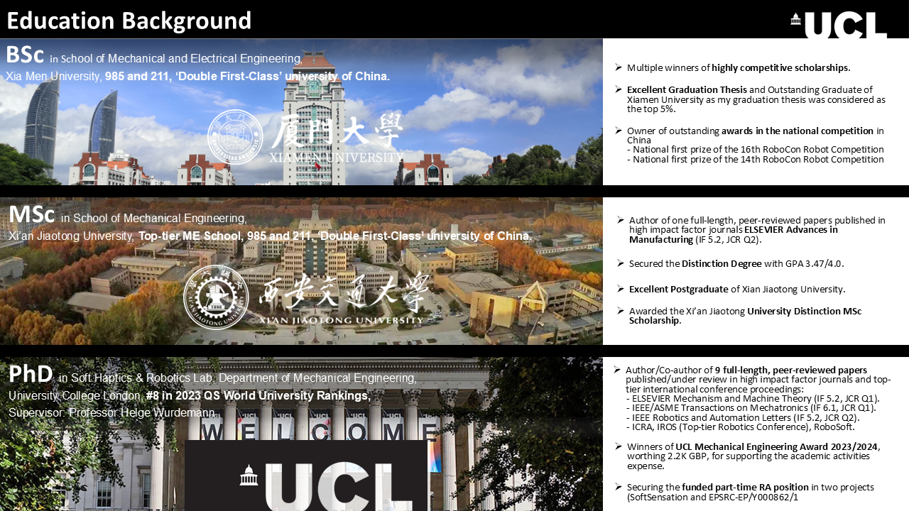

# Dr. Wenlong Goazhang

**UCL Robotics, Department of Mechanical Engineering**
---

## 🔬 Research Interests
- **Bayesian methods** for decision making
- 
- **Gaussian Process-based path planning** for confined marine environments
- **Bio-inspired robotics** for healthcare and industry applications

## 📄 Publications
1. **Goazhang, W.**, et al. "Bio-Inspired Musculoskeletal Hybrid Robot with Model-Based Control." *Journal of Robotics Research*, 2024. [(PDF)](https://example.com)
2. **Goazhang, W.**, et al. "Bayesian Inference for Marine Exploration." *ICRA 2023*. [(DOI)](https://example.com)

## 📬 Contact
📧 Email: wenlong.gaozhang.20@ucl.ac.uk  
🔗 [Google Scholar](https://scholar.google.ca/citations?user=vhKVcqsAAAAJ&hl=en)
---

