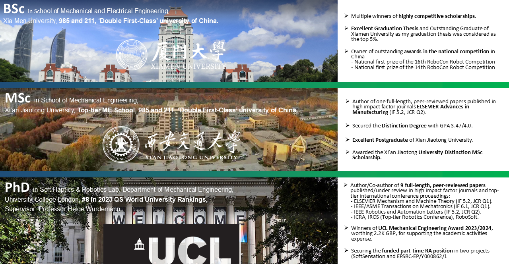
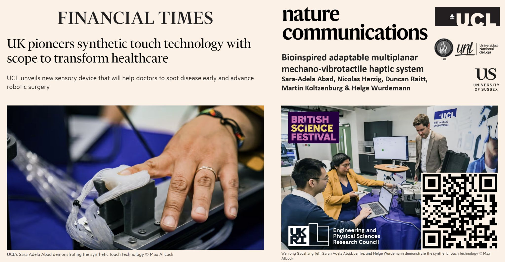

<!--# Dr. Wenlong Goazhang-->
**UCL Robotics, Department of Mechanical Engineering**

---

    
     

        I am a postdoctoral researcher specializing in robotics, with a particular focus on 
        <strong>soft robotics</strong>, <strong>bio-inspired robotics</strong>, and <strong>soft sensing and haptic feedback</strong>. 
        My research explores <strong>hybrid variable stiffness co-bot systems</strong>, 
        <strong>fully soft continuum robots</strong>, <strong>soft tactile sensors</strong>, and  <strong>soft haptic feedback system</strong>,
        aiming to enhance adaptability, functionality, and interaction in robotic systems.
     

     

        I am particularly interested in expanding the application boundaries of soft robotics into 
        <strong>healthcare</strong>, <strong>industry</strong>, <strong>domestic assistance</strong>, and <strong>underwater exploration</strong>.
    

<!-- 解决问题的关键：清除浮动 -->

---

## 🎓 Education

## 🔬 Research Interests
- **Hybrid Variable Stiffness Co-bot System** --- Collaboration with Professor Helge Arne Wurdemann 🔗 [Personal Page](https://helge-wurdemann.com/)  

---

    <video width="100%" controls>
        <source src="assets/videos/1709911266389.mp4" type="video/mp4">
        Your browser does not support the video tag.
    </video>

---

- **Soft Continuum Robots** --- Co-project with Dr. Jialei Shi. 🔗 [Google Scholar](https://scholar.google.com/citations?user=6wK9sHEAAAAJ&hl=zh-CN)  

---

    <video width="100%" controls>
        <source src="assets/videos/2月27日(1).mp4" type="video/mp4">
        Your browser does not support the video tag.
    </video>

---

- **Soft Tactile Sensors** --- Co-project with Dr. Yue Li. 🔗 [Google Scholar](https://scholar.google.co.uk/citations?hl=en&user=H63EvncAAAAJ)

---

    <video width="100%" controls>
        <source src="assets/videos/Demo Video.mp4" type="video/mp4">
        Your browser does not support the video tag.
    </video>

---

- **Soft Haptic Feedback System** --- Project Research Assistant - Dr. Sara Adela Abad G. 🔗 [Google Scholar](https://scholar.google.co.uk/citations?user=dSk73UoAAAAJ&hl=en)

---

---

## 📄 Publications
1. **W Gaozhang**, Y Li, J Shi, Y Wang, A Stilli, H Wurdemann. ''A novel stiffness-controllable joint using antagonistic actuation principles'', _Mechanism and Machine Theory_, 196, 105614.

3. **W Gaozhang**, J Shi, Y Li, A Stilli, H Wurdemann. ''Characterisation of Antagonistically Actuated, Stiffness-Controllable Joint-Link Units for Cobots'', _2023 IEEE International Conference on Robotics and Automation (ICRA)_, 655-661.

4. J Shi, **W Gaozhang**, HA Wurdemann. ''Design and characterisation of cross-sectional geometries for soft robotic manipulators with fibre-reinforced chambers'', _2022 IEEE 5th International Conference on Soft Robotics (RoboSoft)_, 125-131.

6. J Shi, **W Gaozhang**, H Jin, G Shi, HA Wurdemann. ''Characterisation and control platform for pneumatically driven soft robots: Design and applications'', _2023 IEEE International Conference on Soft Robotics (RoboSoft)_, 1-8.

7. Y Li, **W Gaozhang**, J Hu, D Cao, P Dasgupta, H Liu. ''Optical-waveguide based 3-axial tactile sensor for minimally invasive surgical instruments'', _IEEE Robotics and Automation Letters_, 9 (2), 1604-1611.

8. D Zhang, **W Gaozhang**, Q Zhang. ''Alternative flexible correction forming of a blade: multipoint correction with surface measurement and deformation simulation'', _Advances in Manufacturing_, 11 (4), 587-600.

## 📬 Contact
📧 Email: wenlong.gaozhang.20@ucl.ac.uk  
🔗 [Google Scholar](https://scholar.google.ca/citations?user=vhKVcqsAAAAJ&hl=en)  ‖ [LinkedIn](https://www.linkedin.com/in/wenlong-gaozhang-b16962226/?originalSubdomain=uk)
